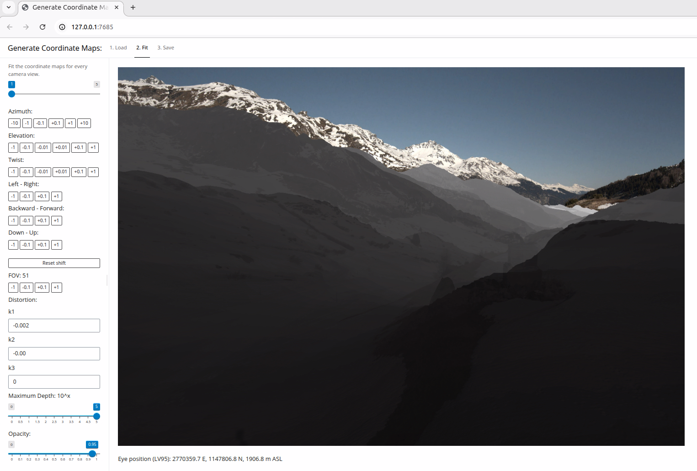

# coordmaps

Georeference outdoor web camera views by rendering [ECEF](https://en.wikipedia.org/wiki/Earth-centered,_Earth-fixed_coordinate_system) coordinate and depth maps from the point of view of the camera:

coordmaps is not ready to use out of the box. You need to provide the location metadata and reference images for the camera that you want to fit. You also have to [download](data/surface3d/download_tiles.R) the raster tiles of the [SwissSurface3d digital surface model](https://www.swisstopo.admin.ch/en/height-model-swisssurface3d-raster), and the [EU-DEM](https://gisco-services.ec.europa.eu/dem/100k/) raster to extend the topography beyond Switzerland. Some changes to the [configuration file](src/r-pkg/R/config.R) (e.g. to specify the image height and width) could also be necessary.